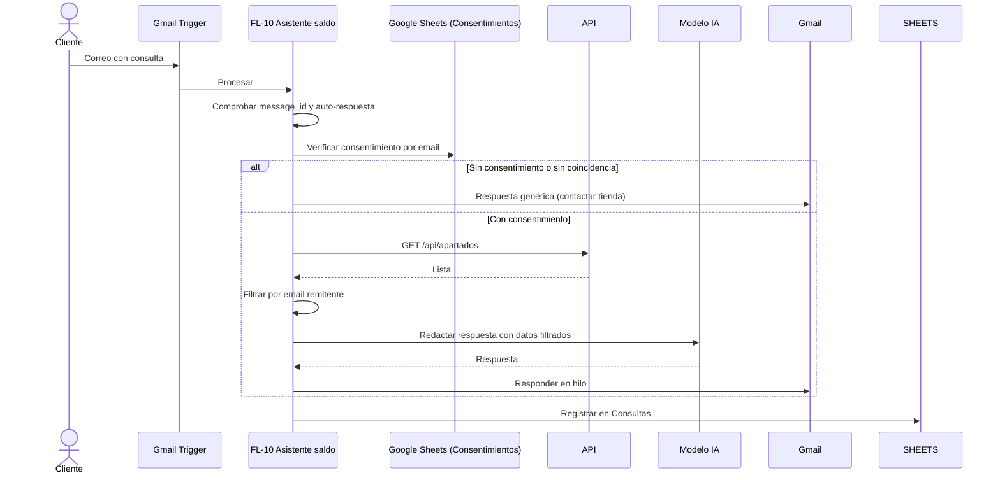

# HU-11 · Asistente de saldo por Gmail (FL-10)

**Disparador:** Gmail Trigger sobre `PF/Consultas` cada minuto  
**Resultado:** Respuesta al cliente con sus apartados

```mermaid
sequenceDiagram
    actor Cliente
    participant GT as Gmail Trigger
    participant FL10 as FL-10 Asistente saldo
    participant CONS as Google Sheets (Consentimientos)
    participant API as API
    participant IA as Modelo IA
    participant GM as Gmail

    Cliente->>GT: Correo con consulta
    GT->>FL10: Procesar
    FL10->>FL10: Comprobar message_id y auto-respuesta
    FL10->>CONS: Verificar consentimiento por email
    alt Sin consentimiento o sin coincidencia
        FL10->>GM: Respuesta genérica (contactar tienda)
    else Con consentimiento
        FL10->>API: GET /api/apartados
        API-->>FL10: Lista
        FL10->>FL10: Filtrar por email remitente
        FL10->>IA: Redactar respuesta con datos filtrados
        IA-->>FL10: Respuesta
        FL10->>GM: Responder en hilo
    end
    FL10->>SHEETS: Registrar en Consultas
```
