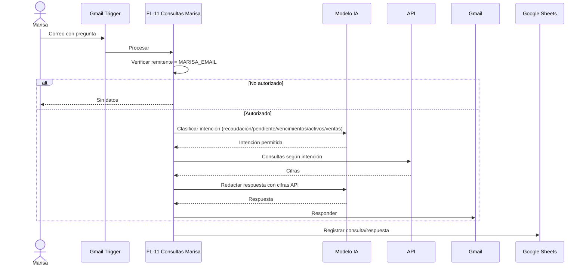

# HU-12 · Consultas de Marisa por Gmail (FL-11)

**Disparador:** Gmail Trigger sobre `PF/Marisa`  
**Resultado:** Respuesta con cifras de la API

```mermaid
sequenceDiagram
    actor Marisa
    participant GT as Gmail Trigger
    participant FL11 as FL-11 Consultas Marisa
    participant IA as Modelo IA
    participant API as API
    participant GM as Gmail
    participant SHEETS as Google Sheets

    Marisa->>GT: Correo con pregunta
    GT->>FL11: Procesar
    FL11->>FL11: Verificar remitente = MARISA_EMAIL
    alt No autorizado
        FL11-->>Marisa: Sin datos
    else Autorizado
        FL11->>IA: Clasificar intención (recaudación/pendiente/vencimientos/activos/ventas)
        IA-->>FL11: Intención permitida
        FL11->>API: Consultas según intención
        API-->>FL11: Cifras
        FL11->>IA: Redactar respuesta con cifras API
        IA-->>FL11: Respuesta
        FL11->>GM: Responder
    end
    FL11->>SHEETS: Registrar consulta/respuesta
```
