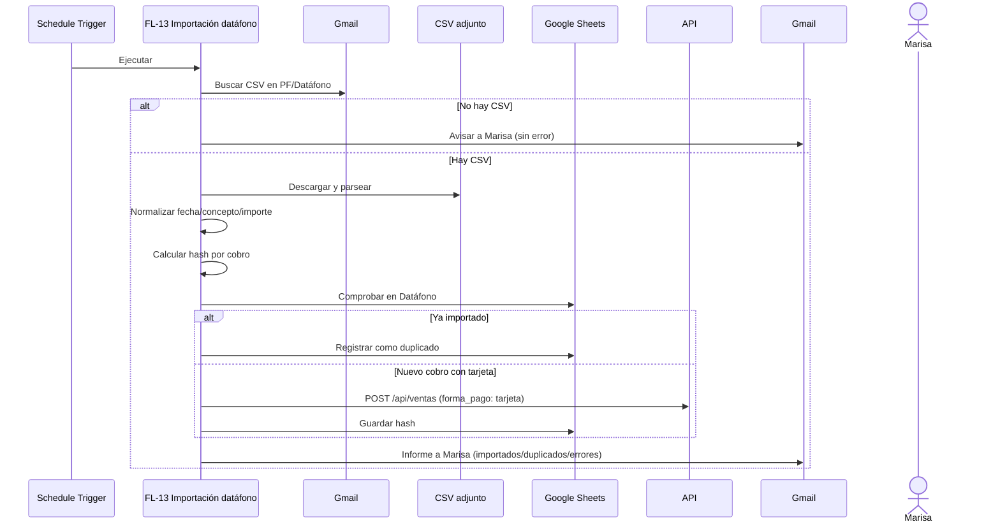

# HU-13b · Importación del datáfono (FL-13)

**Disparador:** Schedule diario 23:00 + búsqueda en Gmail `PF/Datáfono`  
**Resultado:** Ventas con tarjeta importadas sin duplicados

```mermaid
sequenceDiagram
    participant CRON as Schedule Trigger
    participant FL13 as FL-13 Importación datáfono
    participant GT as Gmail
    participant CSV as CSV adjunto
    participant SHEETS as Google Sheets
    participant API as API
    participant GM as Gmail
    actor Marisa

    CRON->>FL13: Ejecutar
    FL13->>GT: Buscar CSV en PF/Datáfono
    alt No hay CSV
        FL13->>GM: Avisar a Marisa (sin error)
    else Hay CSV
        FL13->>CSV: Descargar y parsear
        FL13->>FL13: Normalizar fecha/concepto/importe
        FL13->>FL13: Calcular hash por cobro
        FL13->>SHEETS: Comprobar en Datáfono
        alt Ya importado
            FL13->>SHEETS: Registrar como duplicado
        else Nuevo cobro con tarjeta
            FL13->>API: POST /api/ventas (forma_pago: tarjeta)
            FL13->>SHEETS: Guardar hash
        end
        FL13->>GM: Informe a Marisa (importados/duplicados/errores)
    end
```
