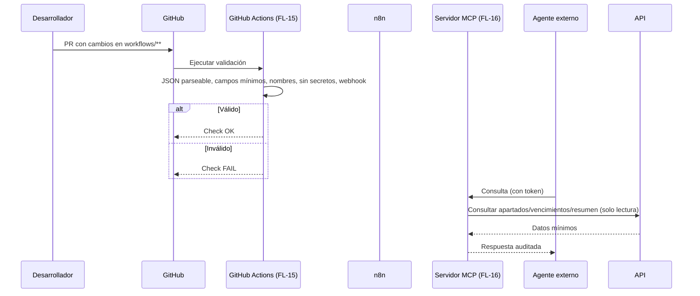

# HU-16 · CI de flujos + Servidor MCP (FL-15, FL-16)

**Disparador:** Pull Request / Consulta de agente  
**Resultado:** Validación de JSON o consulta de apartados

```mermaid
sequenceDiagram
    participant DEV as Desarrollador
    participant GIT as GitHub
    participant CI as GitHub Actions (FL-15)
    participant N8N as n8n
    participant MCP as Servidor MCP (FL-16)
    participant AG as Agente externo
    participant API as API

    DEV->>GIT: PR con cambios en workflows/**
    GIT->>CI: Ejecutar validación
    CI->>CI: JSON parseable, campos mínimos, nombres, sin secretos, webhook
    alt Válido
        CI-->>GIT: Check OK
    else Inválido
        CI-->>GIT: Check FAIL
    end
    AG->>MCP: Consulta (con token)
    MCP->>API: Consultar apartados/vencimientos/resumen (solo lectura)
    API-->>MCP: Datos mínimos
    MCP-->>AG: Respuesta auditada
```
