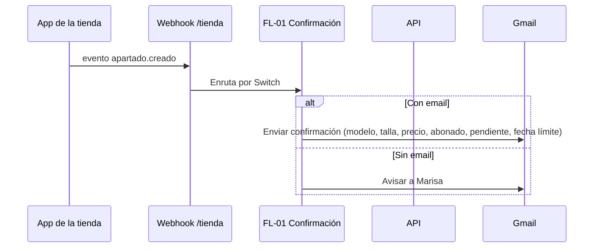

# HU-01 · Confirmación de apartado (FL-01)

**Disparador:** Evento `apartado.creado` desde la app  
**Resultado:** Email de confirmación al cliente o aviso a Marisa si no hay email

```mermaid
sequenceDiagram
    participant APP as App de la tienda
    participant WH as Webhook /tienda
    participant FL01 as FL-01 Confirmación
    participant API as API
    participant GM as Gmail

    APP->>WH: evento apartado.creado
    WH->>FL01: Enruta por Switch
    alt Con email
        FL01->>GM: Enviar confirmación (modelo, talla, precio, abonado, pendiente, fecha límite)
    else Sin email
        FL01->>GM: Avisar a Marisa
    end
```
