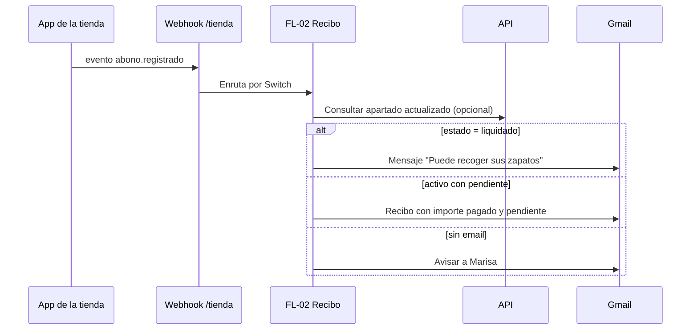

# HU-02 · Recibo de abono (FL-02)

**Disparador:** Evento `abono.registrado` desde la app  
**Resultado:** Recibo al cliente o mensaje de recogida si queda liquidado

```mermaid
sequenceDiagram
    participant APP as App de la tienda
    participant WH as Webhook /tienda
    participant FL02 as FL-02 Recibo
    participant API as API
    participant GM as Gmail

    APP->>WH: evento abono.registrado
    WH->>FL02: Enruta por Switch
    FL02->>API: Consultar apartado actualizado (opcional)
    alt estado = liquidado
        FL02->>GM: Mensaje "Puede recoger sus zapatos"
    else activo con pendiente
        FL02->>GM: Recibo con importe pagado y pendiente
    else sin email
        FL02->>GM: Avisar a Marisa
    end
```
