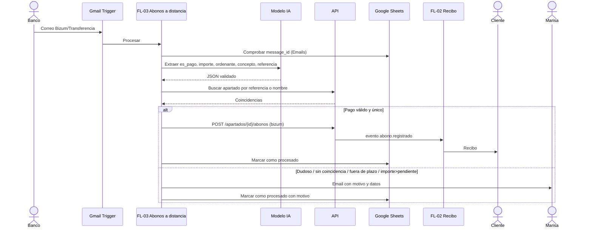

# HU-03 · Abonos a distancia (FL-03)

**Disparador:** Gmail Trigger sobre etiqueta `PF/Banco` cada minuto  
**Resultado:** Abono registrado o consulta a Marisa

```mermaid
sequenceDiagram
    actor Banco
    participant GT as Gmail Trigger
    participant FL03 as FL-03 Abonos a distancia
    participant IA as Modelo IA
    participant API as API
    participant SHEETS as Google Sheets
    participant FL02 as FL-02 Recibo
    actor Cliente
    actor Marisa

    Banco->>GT: Correo Bizum/Transferencia
    GT->>FL03: Procesar
    FL03->>SHEETS: Comprobar message_id (Emails)
    FL03->>IA: Extraer es_pago, importe, ordenante, concepto, referencia
    IA-->>FL03: JSON validado
    FL03->>API: Buscar apartado por referencia o nombre
    API-->>FL03: Coincidencias
    alt Pago válido y único
        FL03->>API: POST /apartados/{id}/abonos (bizum)
        API->>FL02: evento abono.registrado
        FL02->>Cliente: Recibo
        FL03->>SHEETS: Marcar como procesado
    else Dudoso / sin coincidencia / fuera de plazo / importe>pendiente
        FL03->>Marisa: Email con motivo y datos
        FL03->>SHEETS: Marcar como procesado con motivo
    end
```
