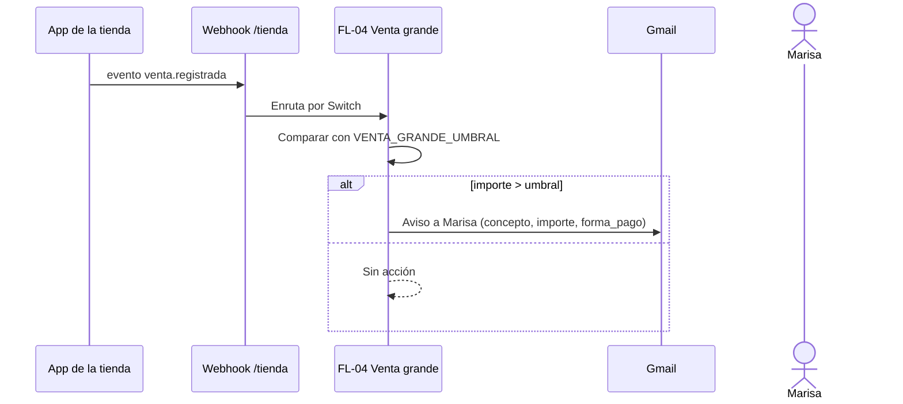

# HU-04 · Venta grande (FL-04)

**Disparador:** Evento `venta.registrada`  
**Resultado:** Aviso a Marisa si `importe > VENTA_GRANDE_UMBRAL`

```mermaid
sequenceDiagram
    participant APP as App de la tienda
    participant WH as Webhook /tienda
    participant FL04 as FL-04 Venta grande
    participant GM as Gmail
    actor Marisa

    APP->>WH: evento venta.registrada
    WH->>FL04: Enruta por Switch
    FL04->>FL04: Comparar con VENTA_GRANDE_UMBRAL
    alt importe > umbral
        FL04->>GM: Aviso a Marisa (concepto, importe, forma_pago)
    else
        FL04-->>FL04: Sin acción
    end
```
