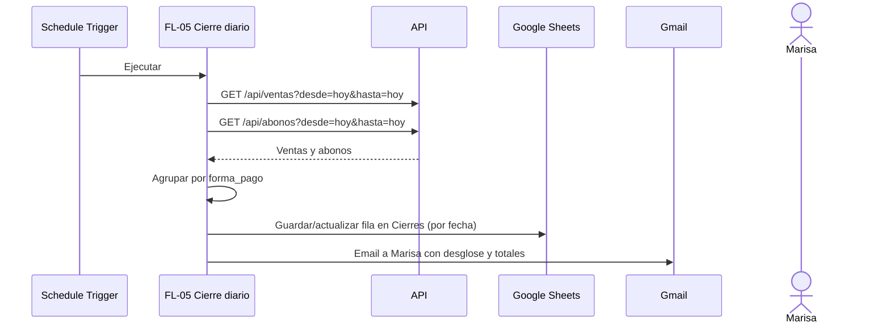

# HU-05 · Cierre diario (FL-05)

**Disparador:** Schedule 21:30 (Europe/Madrid)  
**Resultado:** Cierre por forma de pago en Google Sheets y email a Marisa

```mermaid
sequenceDiagram
    participant CRON as Schedule Trigger
    participant FL05 as FL-05 Cierre diario
    participant API as API
    participant SHEETS as Google Sheets
    participant GM as Gmail
    actor Marisa

    CRON->>FL05: Ejecutar
    FL05->>API: GET /api/ventas?desde=hoy&hasta=hoy
    FL05->>API: GET /api/abonos?desde=hoy&hasta=hoy
    API-->>FL05: Ventas y abonos
    FL05->>FL05: Agrupar por forma_pago
    FL05->>SHEETS: Guardar/actualizar fila en Cierres (por fecha)
    FL05->>GM: Email a Marisa con desglose y totales
```
