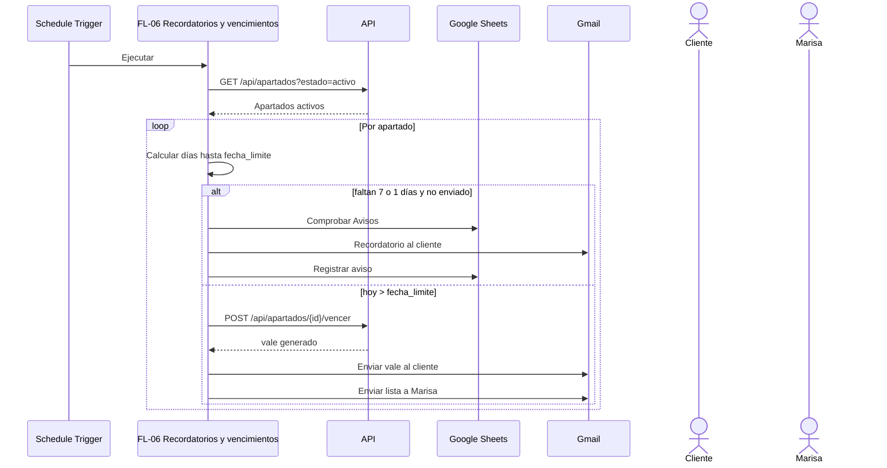

# HU-06 · Recordatorios y vencimientos (FL-06)

**Disparador:** Schedule 08:00 (Europe/Madrid)  
**Resultado:** Recordatorios a 7 y 1 días, vencimiento por API y vale

```mermaid
sequenceDiagram
    participant CRON as Schedule Trigger
    participant FL06 as FL-06 Recordatorios y vencimientos
    participant API as API
    participant SHEETS as Google Sheets
    participant GM as Gmail
    actor Cliente
    actor Marisa

    CRON->>FL06: Ejecutar
    FL06->>API: GET /api/apartados?estado=activo
    API-->>FL06: Apartados activos
    loop Por apartado
        FL06->>FL06: Calcular días hasta fecha_limite
        alt faltan 7 o 1 días y no enviado
            FL06->>SHEETS: Comprobar Avisos
            FL06->>GM: Recordatorio al cliente
            FL06->>SHEETS: Registrar aviso
        else hoy > fecha_limite
            FL06->>API: POST /api/apartados/{id}/vencer
            API-->>FL06: vale generado
            FL06->>GM: Enviar vale al cliente
            FL06->>GM: Enviar lista a Marisa
        end
    end
```
