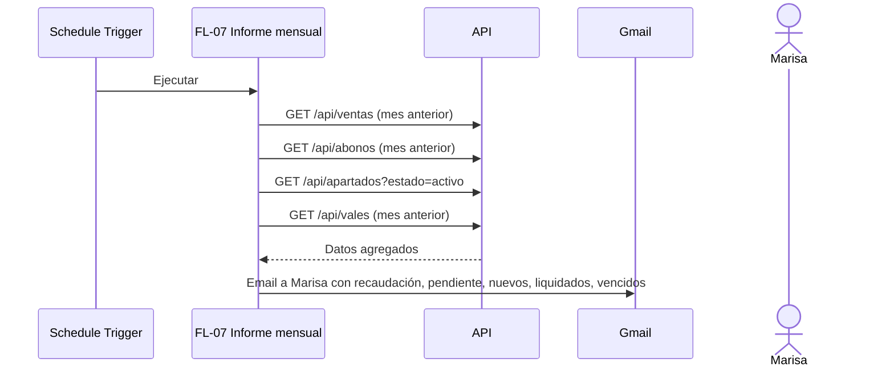

# HU-07 · Informe mensual (FL-07)

**Disparador:** Schedule día 1 a las 08:00 (Europe/Madrid)  
**Resultado:** Informe mensual a Marisa

```mermaid
sequenceDiagram
    participant CRON as Schedule Trigger
    participant FL07 as FL-07 Informe mensual
    participant API as API
    participant GM as Gmail
    actor Marisa

    CRON->>FL07: Ejecutar
    FL07->>API: GET /api/ventas (mes anterior)
    FL07->>API: GET /api/abonos (mes anterior)
    FL07->>API: GET /api/apartados?estado=activo
    FL07->>API: GET /api/vales (mes anterior)
    API-->>FL07: Datos agregados
    FL07->>GM: Email a Marisa con recaudación, pendiente, nuevos, liquidados, vencidos
```
