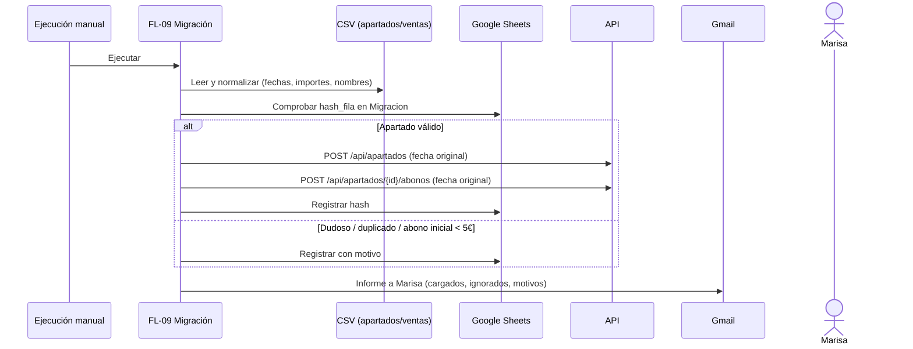

# HU-09 · Migración del Excel (FL-09)

**Disparador:** Ejecución manual  
**Resultado:** Apartados, abonos y ventas históricos cargados por API

```mermaid
sequenceDiagram
    participant MAN as Ejecución manual
    participant FL09 as FL-09 Migración
    participant CSV as CSV (apartados/ventas)
    participant SHEETS as Google Sheets
    participant API as API
    participant GM as Gmail
    actor Marisa

    MAN->>FL09: Ejecutar
    FL09->>CSV: Leer y normalizar (fechas, importes, nombres)
    FL09->>SHEETS: Comprobar hash_fila en Migracion
    alt Apartado válido
        FL09->>API: POST /api/apartados (fecha original)
        FL09->>API: POST /api/apartados/{id}/abonos (fecha original)
        FL09->>SHEETS: Registrar hash
    else Dudoso / duplicado / abono inicial < 5€
        FL09->>SHEETS: Registrar con motivo
    end
    FL09->>GM: Informe a Marisa (cargados, ignorados, motivos)
```
